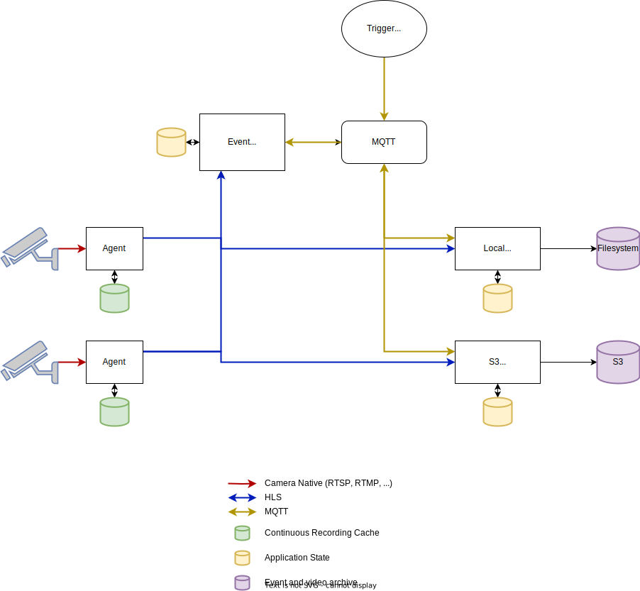

# Architecture

Satori is designed with the [UNIX philosophy](https://en.wikipedia.org/wiki/Unix_philosophy#Do_One_Thing_and_Do_It_Well) in mind.
As such a complete system has several components, each with their own specific responsibility.

Each component is fully described below:

- [Agent](../agent/)
- [Event Processor](../event-processor/)
- [Archiver](../archiver/)

Communication between components is performed via [MQTT](https://wikipedia.org/wiki/MQTT) for signalling and [HTTP Live Streaming](https://wikipedia.org/wiki/HTTP_Live_Streaming) for media transport.

## Diagram

